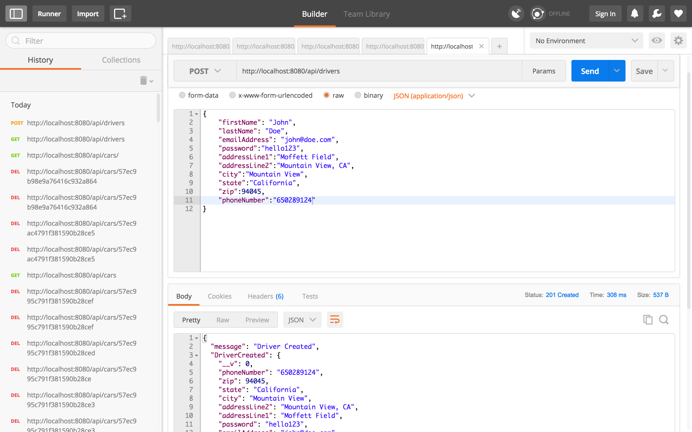
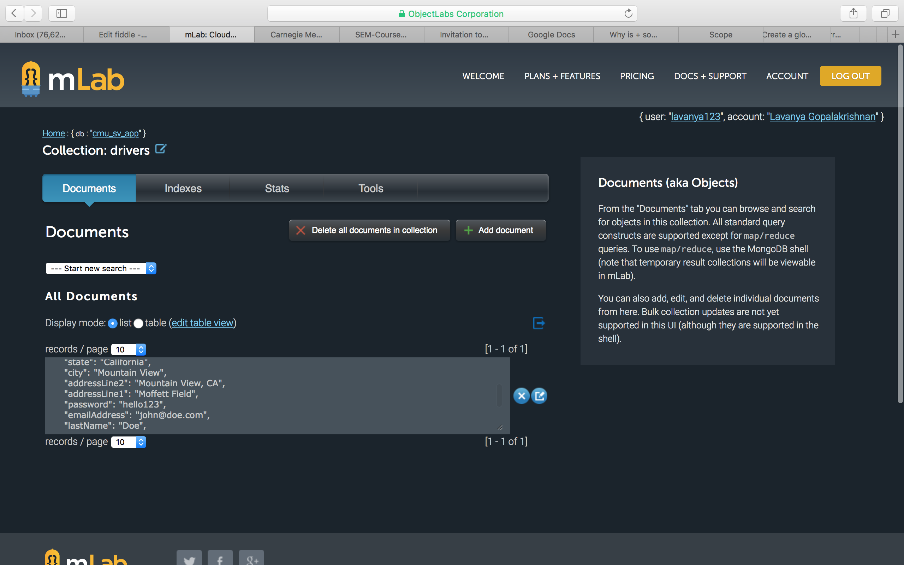
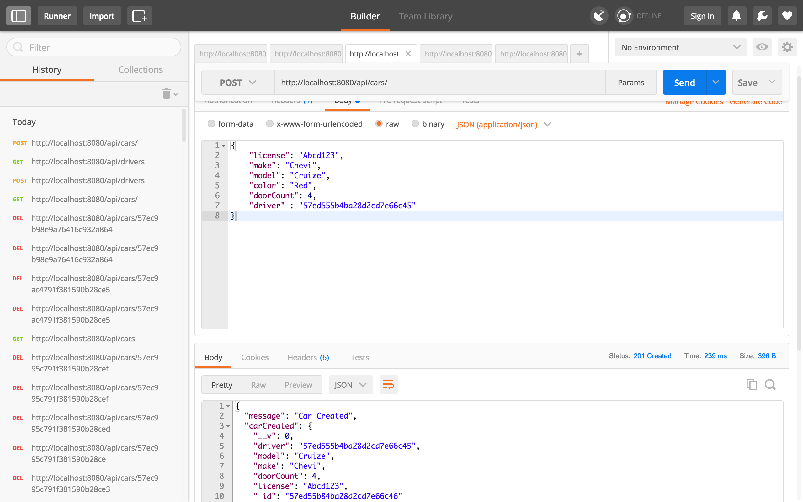
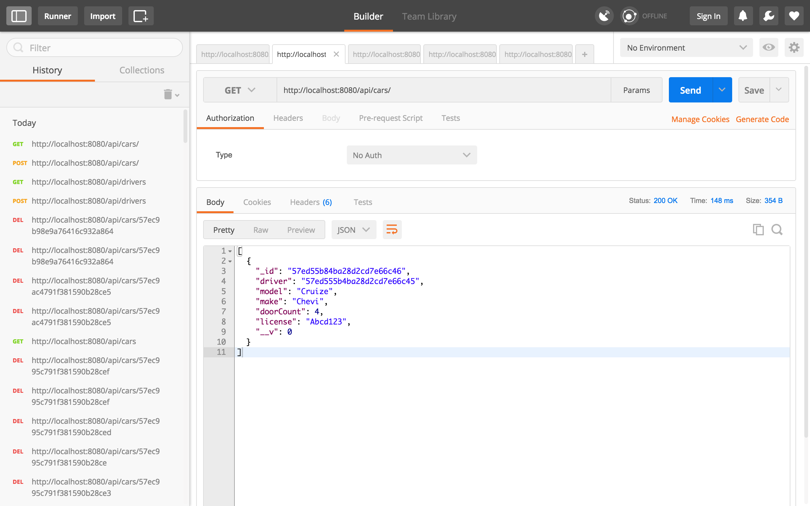
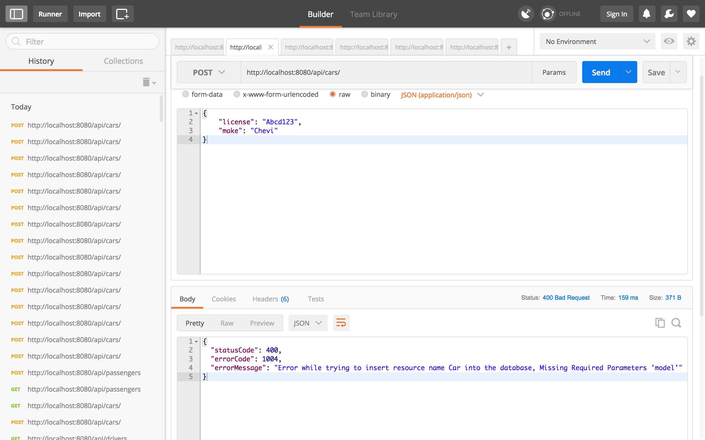
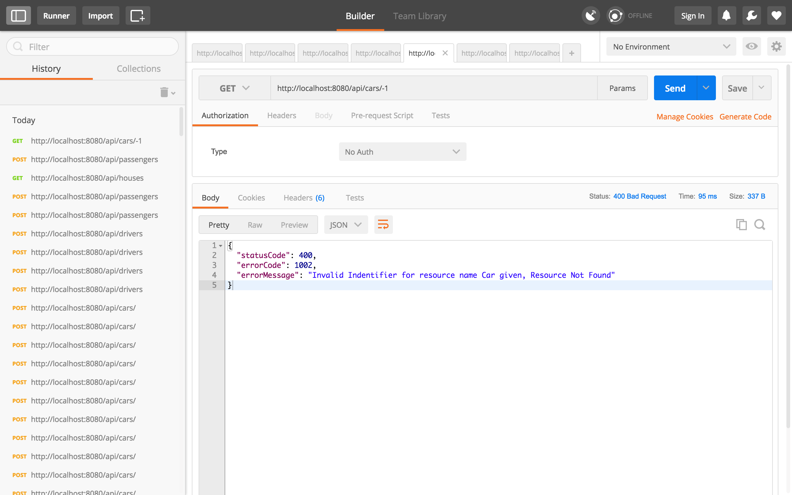

## Error Codes

Error Code  | Error Message   | Relevant Resources  | Parameters
----------- | ----------|------------ |-----
1001 | Invalid resource, {0}, given  | All Resources  | `0 - Resource Name`
1002 | Invalid Identifier for resource, {0}, Resource Instance Not Found | All Resources | `0 - Resource Name`
1003 | Invalid Property {0} for resource, {1},  given | All Resources | `0 - Property` , `1 - Resource Name` 
1004 | Error while trying to insert resource, {0}, into the database. Missing Required Properties: {1} | All Resources | `0 - Resource Name`, `1 - Property Name`
1005 | Database Error while trying to {0} resource, {1}: {2} | All Resources | `0 - Operation(insert, delete, update)`, `1 -  - Resource Name`, `2 - Error Message/Message Summary `
1007 | Error while inserting an instance of the resource, {0}, to database, duplicate {1} found | All Resources | `0 - Resource Name`, `1 - Unique Property Name`
1008 | Error while updating resource, {0}, no valid property in the POST request | All Resources | `0 - Resource Name`
1009 | Invalid property value error for {0} : {1} | All Resources | `0 - Resource Name`, `1 - Property Name`
2001 | Ride has not started yet, current status: {0} | Ride | `0 - Current Status of the Ride`
2002 | Internal error, Ride route is empty | Ride |  `None`


# Test Cases
```


```

# Preview







